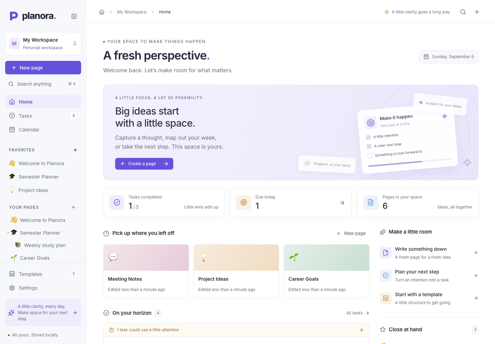
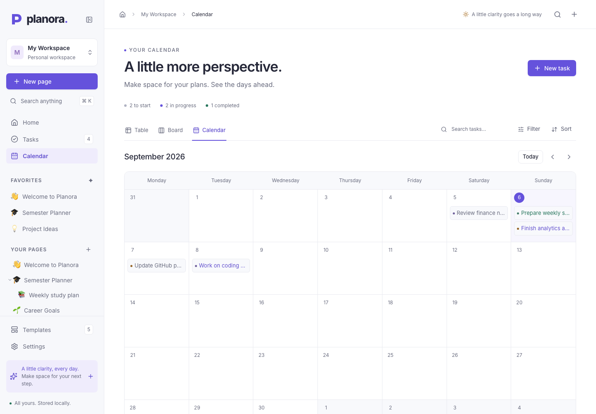
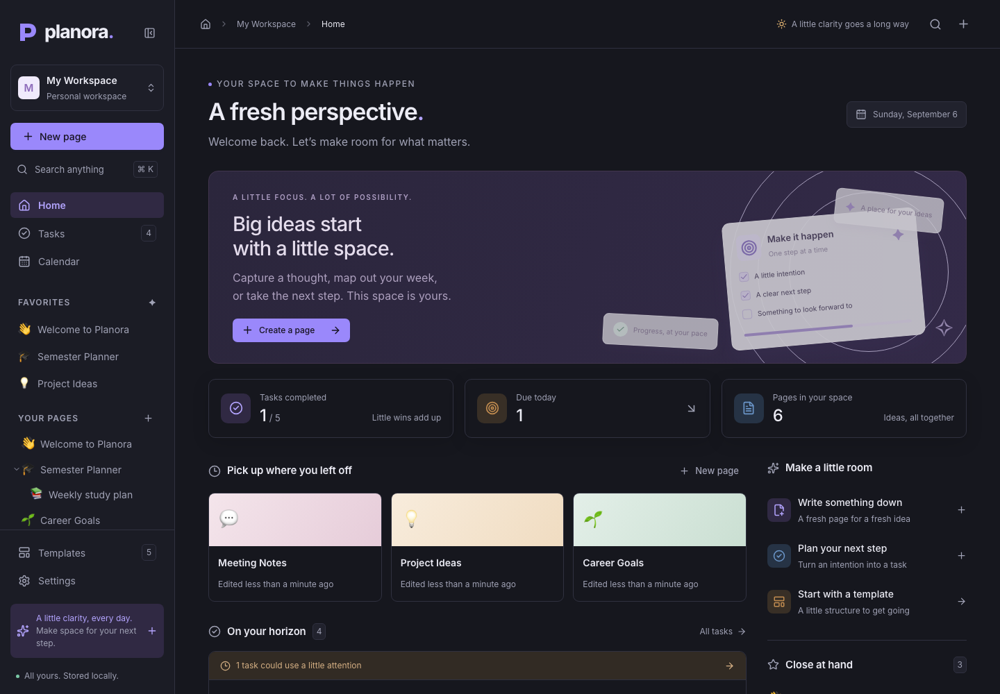
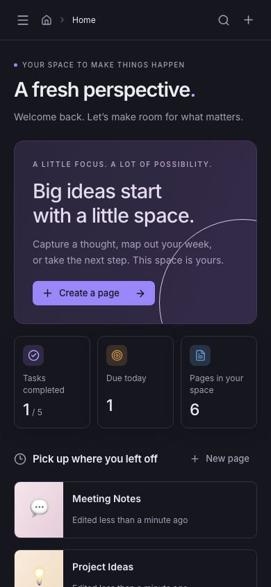

# Planora

**Plan your work. Organize your life.**

Planora is a complete local workspace for rich-text notes, nested pages, tasks, and task databases. It combines a thoughtfully designed interface with a typed, validated backend and a relational SQLite database. It runs on your computer, without an account, API key, or paid service.

Built to demonstrate full-stack TypeScript engineering: server-rendered routing, data modeling, transactional mutations, optimistic interaction, rich-text persistence, accessibility, and automated testing.

## Features

- **Workspace dashboard:** recently edited and created pages, favorites, upcoming and overdue tasks, and progress calculated from actual records.
- **Nested pages:** create, rename, move, duplicate complete subtrees, reorder siblings, favorite, and delete. Choose an emoji and one of five original gradient covers.
- **Rich-text editor:** paragraphs, three heading levels, bold, italic, underline, strike, inline code, code blocks, links, quotes, dividers, ordered and bulleted lists, and nested checklists.
- **Block controls:** a searchable slash menu with arrow-key navigation, drag handles, and toolbar buttons to move blocks using the keyboard.
- **Resilient autosave:** an 800 ms debounce, serialized saves, revision conflict detection, visible save/error states, and recoverable device drafts.
- **Tasks:** descriptions, status, priority, date-only deadlines, tags, completion timestamps, search, filters, and sorting.
- **Three connected views:** an inline-editable table, a draggable Kanban board, and a month calendar. They all operate on the same task records.
- **Task databases:** create named collections, edit their details, and view a collection through any of the three task views. Removing a collection preserves its tasks.
- **Global search:** search page titles and text, tasks, and tags. Jump directly to a page, task dialog, or tag-filtered task list.
- **Command palette:** press `⌘K` on macOS or `Ctrl+K` on other platforms to search or run common actions.
- **Five editable templates:** blank page, weekly planner, meeting notes, project planner, and study planner.
- **Personalization:** light, dark, or system appearance; workspace naming; and a guarded demo reset.
- **Responsive UI:** collapsible desktop navigation, a focus-trapped mobile drawer, loading states, empty states, dialogs, and toast feedback.

## Screenshots

Real screenshots captured from the seeded application during browser verification:





<details>
<summary>Dark appearance and mobile layout</summary>





</details>

## Tech Stack

| Layer         | Technology                                                        |
| ------------- | ----------------------------------------------------------------- |
| Application   | Next.js 16 App Router, React 19                                   |
| Language      | Strict TypeScript                                                 |
| Styling       | Tailwind CSS 4, original CSS design tokens, locally bundled Inter |
| UI primitives | Radix dialogs and menus, cmdk, Lucide, Sonner                     |
| Rich text     | TipTap 3 / ProseMirror                                            |
| Drag and drop | dnd-kit for pages and boards; TipTap for editor blocks            |
| Persistence   | Prisma 7, SQLite, better-sqlite3                                  |
| Validation    | Zod 4 and the ProseMirror document schema                         |
| Dates         | date-fns; date-only strings for deadlines                         |
| Testing       | Vitest, real SQLite integration tests, Playwright, axe-core       |
| Quality       | ESLint, TypeScript, Prettier, production-build verification       |

Versions are locked in `package-lock.json`. Prisma's CLI, client, and driver adapter use the same stable major/minor release. The CLI is intentionally pinned to the stable 7.x line rather than the release candidate currently published under npm's `latest` tag. Two transitive dependency overrides select patched releases of `deepmerge-ts` and `mysql2`; see `package.json`.

## Architecture

Next.js Server Components query SQLite and render route-specific data. Small Client Components handle interactive surfaces. All mutations cross a server boundary, validate their payloads, and scope their queries to the active workspace.

```text
src/
  app/                 Server-rendered routes, error/loading states, actions
    api/               Bounded search and revision-aware editor-save endpoints
    workspace/         Dashboard, documents, tasks, calendar, templates, settings
  components/
    layout/            Workspace shell, navigation, command/dialog coordination
    editor/            TipTap editor, formatting toolbar, slash commands
    pages/             Page management and templates
    tasks/             Shared task forms, table, board, calendar, filters
    database/          Collection management
    home/              Dashboard
    search/            Command palette
    settings/          Appearance and workspace preferences
    ui/                Reusable accessible primitives
  hooks/               Autosave and draft recovery
  lib/
    server/            Database queries, domain operations, seed logic
    validation.ts      Input validation and safe rich-text content constraints
    hierarchy.ts       Cycle detection, depth limits, subtree traversal
    task-filters.ts    Pure shared filtering and sorting
prisma/                Schema, checked-in SQL migrations, seed entry point
tests/                 Unit, SQLite integration, and browser tests
scripts/               Isolated browser-test server setup
```

### Decisions that protect data

- **Creation and updates have different schemas.** A partial task update cannot reset an omitted priority, deadline, tag, or collection.
- **Page trees are transactional.** Moves reject cycles, missing destinations, and nesting beyond 12 levels. Duplication copies the complete subtree.
- **Deleting a parent deletes its descendants.** The confirmation dialog shows how many nested pages will be removed. Foreign keys enforce cascading deletion. There is no trash in version 1.
- **Editor saves use optimistic concurrency.** Every update matches an expected revision and increments it. A stale tab gets an actionable conflict instead of overwriting newer work.
- **Draft recovery is explicit.** A device draft can be restored or discarded after reload. Drafts are a recovery aid; SQLite remains the durable source of truth.
- **Deadlines are calendar dates.** `YYYY-MM-DD` avoids moving a task to a different day because of timezone conversion. Created, updated, and completed timestamps remain proper date-time values.
- **Views share records.** Board movements update task status, while deleting a database sets its tasks' `databaseId` to null.
- **Templates are versioned in code.** Creating a page materializes the template as independent TipTap JSON.

The default production build uses Next.js's supported Webpack builder. Development uses Turbopack. This keeps production builds portable in environments that restrict child-process port binding.

## Database

| Model       | Purpose and relationships                                                                                                         |
| ----------- | --------------------------------------------------------------------------------------------------------------------------------- |
| `Workspace` | Owns pages, tasks, tags, and databases; provides the boundary for future membership/authentication                                |
| `Page`      | Self-referencing parent/children tree; JSON content, searchable plain text, icon, cover, favorite, position, revision, timestamps |
| `Task`      | Workspace record with status, priority, due date, completion timestamp, optional database, and many tags                          |
| `Database`  | Named task collection; deleting it keeps its records in general tasks                                                             |
| `Tag`       | Workspace-scoped unique name; many-to-many relation to tasks                                                                      |

Indexes support workspace queries, parent/position ordering, favorites, recently updated content, task status/deadline, and collection membership. Favorites are a page property in the single-user version.

SQLite data lives at `prisma/dev.db` by default and is never committed. To back it up, stop the app and copy the database file. Keep the backup private if your workspace contains personal information.

## Getting Started

### Requirements

- Node.js **22.12 or newer**; Node.js 24 LTS is recommended.
- npm; the lockfile is committed.
- If your system cannot use a prebuilt `better-sqlite3` binary, install the native build tools for your operating system.

From the repository root:

```bash
npm install
cp .env.example .env
npm run db:setup
npm run dev
```

Open [Planora locally](http://127.0.0.1:3000/workspace).

`db:setup` generates the Prisma client, applies checked-in migrations, and seeds the workspace. Seeding is **idempotent**: running it again leaves existing data intact. To intentionally replace all data, use **Settings → Reset demo** and type `RESET`.

If your npm version blocks dependency install scripts, review and approve the required packages, then rebuild them:

```bash
npm install-scripts approve better-sqlite3 esbuild unrs-resolver prisma @prisma/engines
npm rebuild better-sqlite3 esbuild unrs-resolver prisma @prisma/engines
npm run db:setup
```

The `install-scripts` command applies to npm versions with that approval feature. Standard npm installations normally run these steps during `npm install`.

### Individual database commands

```bash
npx prisma generate
npx prisma migrate deploy
npm run db:seed
```

After changing the schema during development, create a migration:

```bash
npx prisma migrate dev --name describe_your_change
```

Commit the generated migration and schema together. New installations should use `migrate deploy` to apply the reviewed migrations.

## Environment Variables

| Variable       | Default                | Purpose                                     |
| -------------- | ---------------------- | ------------------------------------------- |
| `DATABASE_URL` | `file:./prisma/dev.db` | SQLite path relative to the repository root |

`.env.example` contains a local file URL, not a credential. `.env`, SQLite databases, generated Prisma code, and build outputs are ignored. No API keys are needed. Inter is bundled locally; the application does not fetch fonts or decorative assets at runtime.

## Running the Application

### Public portfolio demo

The `demo/` entry point reuses the application's React components, styles, templates, and validators. It builds a separate static site: every visitor receives independent sample data stored in that browser's local storage. It never connects to or uploads your SQLite database. Browser storage can be cleared or evicted and does not synchronize between devices; the demo banner makes this distinction visible.

```bash
npm run demo:build
npm run demo:preview
npm run test:demo
```

The full-stack local application below continues to use Prisma and SQLite. The static demo uses a narrowly scoped browser adapter for navigation, actions, search, and editor saves. Its deployment archive contains only built public assets, without server code, environment files, or local data.

### Full-stack local application

```bash
npm run dev          # Local development, bound to 127.0.0.1:3000
npm run build        # Generate Prisma client and create the production build
npm start            # Run the production build on 127.0.0.1:3000
```

Stop the development server before starting production on the same port. For another port, append `-- --port 3001` to `npm run dev` or `npm start`.

On macOS, after installation, double-click **Start Planora.command** to reopen the local workspace. Keep its Terminal window open while using Planora. The launcher uses Node.js from your PATH, with the bundled Codex runtime as an optional fallback. A local `127.0.0.1` link works only on the computer running the server; stopping it or restarting the computer makes that link unavailable until you launch the app again.

### Authentication and deployment scope

**Authentication is not implemented in version 1.** Planora is a single-user, locally hosted portfolio application. Everyone who can reach its server shares the workspace. The supplied start commands bind to the loopback interface.

Do not expose the app to an untrusted network without adding authentication, workspace membership checks, and a deployment-specific security review. Workspace ownership is centralized in the server layer to make that evolution straightforward. SQLite requires a persistent filesystem; an ephemeral/serverless deployment needs a different persistence strategy.

## Testing

```bash
npm run typecheck
npm run lint
npm run test
npm run format:check
npm run build
```

Unit tests cover validation, calendar dates, content safety, hierarchy cycles and depth, completion semantics, and view filtering/sorting. Integration tests exercise real SQLite transactions, seeding, subtree duplication/deletion, exact sibling reordering, editor revision conflicts, partial task updates, and preservation of tasks when a collection is deleted. They create and clean up their own temporary database.

Run the browser suite after a production build:

```bash
npx playwright install chromium
npm run build
npm run test:e2e
```

Playwright starts the production application on **port 3100**, migrates and seeds a disposable database inside `.e2e/`, and leaves `prisma/dev.db` untouched. Tests cover complete page/task workflows, slash commands, autosave after reload, board dragging, calendar editing, templates, search, themes, settings, mobile navigation, accessibility, and guarded reset. Reports and failure traces are ignored by Git.

The verified suite contains **29 unit/integration tests and 12 browser workflows**. Browser coverage includes native editor block dragging, save retries, saving during navigation, concurrent-tab draft recovery, repeated task search, and accessibility checks in both themes. These checks passed alongside TypeScript, lint, formatting, and the production build on September 6, 2026. Automated accessibility checks complement, rather than replace, manual usability review.

To regenerate the README screenshots from the disposable demo after a production build, run `UPDATE_SCREENSHOTS=1 npm run test:e2e` on macOS/Linux. The optional flag captures screenshots only after the reset workflow has restored clean demo content.

```bash
npm run format       # Format source and documentation
```

## Current Limitations

- One local workspace and one user; no authentication, sharing, or realtime collaboration.
- Databases are collections of tasks with fixed properties, rather than arbitrary custom schemas.
- No trash, uploads, image attachments, comments, reminders, or cloud synchronization.
- Covers are original gradient visuals. There are no remote image dependencies.
- Search uses indexed workspace scopes and bounded results with SQL substring matching; it is not a full-text search engine.
- The task screen loads its current collection in memory for filtering. Large workspaces would benefit from server pagination and virtualized rows.
- Autosave requires the local server to be running. Device drafts can help after connection loss, but this is not an offline-first application.
- Concurrent page content edits are detected, not merged. Reload and explicitly restore a draft to resolve a conflict.

## Future Improvements

Practical next steps include authentication and workspace sharing, trash and page history, custom database properties, server-side pagination, Markdown import/export, file uploads, comments and notifications, external calendar integration, and cloud synchronization. Realtime collaboration, a mobile application, and optional AI-assisted notes would be later extensions.

## License

[MIT](LICENSE). Planora has original branding, visual design, and interface wording. It is not affiliated with Notion or any other workspace product.
